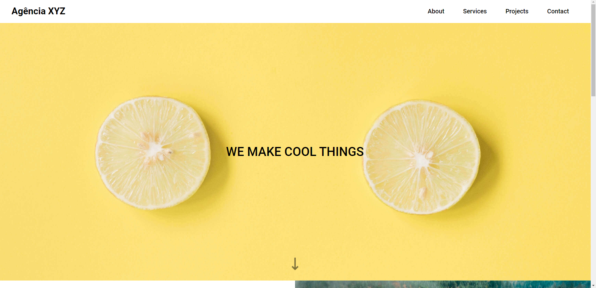
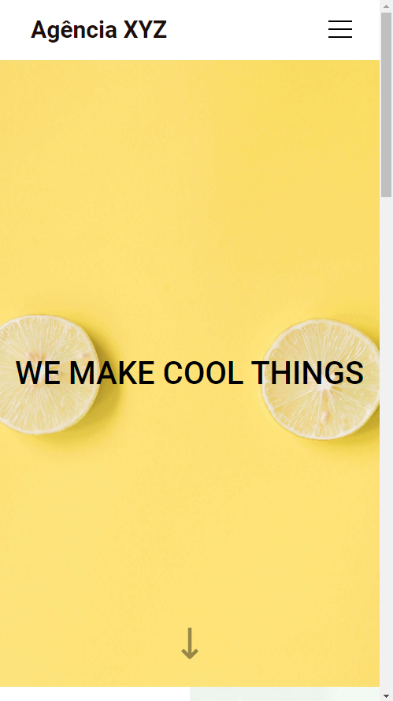

# Projeto Agência XYZ | Landing Page | DevQuest 🚀

* Um desafio proposto no curso DevQuest sobre uma Landing Page, chamada de <a href="https://matias-ezequiel-correa.github.io/landingpage-grid-agenciaxyz/" target="_blank">Agência XYZ.</a> 

* Para aprimorar e consolidar os conhecimentos e habilidades adquiridos nos módulos de HTML e CSS do curso. 

* Utilizando os conceitos de grid.

## Design:
* Desktop:

* Mobile:

## Tecnologias utilizadas:

 * HTML
 * CSS

 ### Pra entrar em contato, veja as redes abaixo!
 

 
  
  
   

